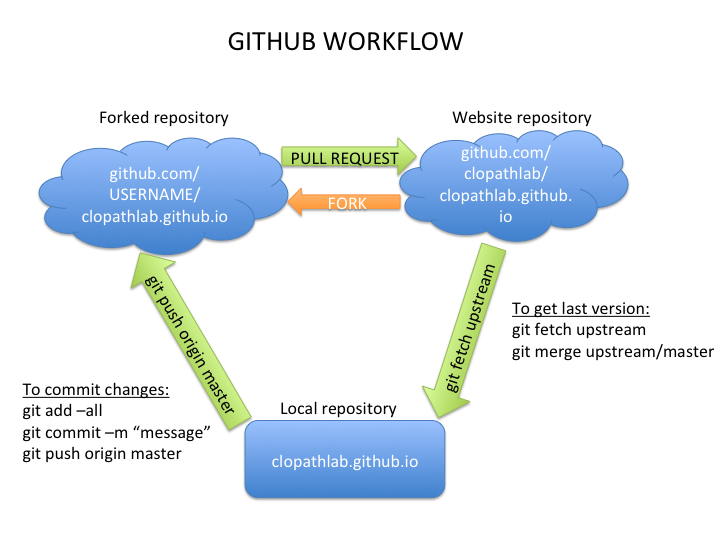

# Clopath Lab Website WIKI

This static website is generated with Jekyll. Below, you will find the instruction to 
* install Jekyll
* modify the website
* deploy the website online

## 1. Install Jekyll

a. and b. are probably not necessary. Try c. first and do a. and b. if c. doesn't work

### On OSX
    
    brew install node
    gem install jekyll

if the command 'gem install...' doesn't work, go to the end of the page for instructions how to install rubygem
    
### On Linux

    sudo apt-get purge jekyll ruby nodejs npm
    sudo apt-get autoclean
    sudo apt-get update
    sudo apt-get install ruby nodejs npm ruby-dev
    sudo gem install jekyll jekyll-watch

## Github Workflow

## 2. Modify the website: for the first time

### a. Fork the repository
- Create a github account if you don't have one: <https://github.com>
- Go to <https://github.com/clopathlab/clopathlab.github.io> and fork the repository.
- The repository is now forked into your repositories

### b. Clone the repository
    git clone https://github.com/YOUR-USERNAME/clopathlab.github.io
    cd clopathlab.github.io
    git remote set-url origin https://github.com/YOUR-USERNAME/clopathlab.github.io.git
    git remote add upstream https://github.com/clopathlab/clopathlab.github.io.git

## 2. Modify the website
To avoid merge conflicts, it is good to update the repository before doing any changes locally

### a. Update your forked repository
Go to your local folder where you cloned the repository 

Fetch the last changes

    git fetch upstream
     
Merge the changes from upstream/master into your local master branch. This brings your fork's master branch into sync 
with the upstream repository, without losing your local changes.

    git merge upstream/master
    
Now push the changes to your remote fork

    git push origin master

### b. Modify the website
First, let's run the website locally. CD to your folder and type

    jekyll serve    
 
#### Root pages
If you want to add a new ROOT page (such as contact, fundings, ...), copy and paste one that you like and modify it.
Don't forget to modify the METADATA at the top of the page, for example:

    ---
    layout: noimage
    group: navigation
    linkname: contact
    title: Contact Us - Computational Neuroscience Laboratory, London, UK
    pagetitle: Contact Us
    ---
    
- layout: noimage or default (if you want an image on top) - the layouts are defined in the _layouts folder. 
You can create a new one if you like
- group: if navigation, a link will appear in the menu of the website
- linkname: the link name in the menu
- title: HTML page title (displayed by Google in the search results)
- pagetitle: the title at the top of the page
- it's done. Check locally if that works <http://localhost:4001>

#### Members pages
- Copy and paste the page of a lab member, found in the folder: members
- Give it a name such as firstname_lastname.html
- Edit the _data/people.yaml file and add the linkname of your page

    - name: Claudia Clopath 
      position: Principal Investigator 
      image: claudia_cropped.jpg
      link: claudia_clopath
      
- it's done. Check locally if that works <http://localhost:4001/members/firstname_lastname>

#### Publications
- Edit the file _data/publications.yaml
- it's done. Check locally if that works <http://localhost:4001/publications>

#### Codes
- Edit the file _data/codes.yaml
- it's done. Check locally if that works <http://localhost:4001/code>

### c. Push your changes
    git add --all
    git commit -m "My commit message"
    git push origin master
    
### d. Create a pull request
- Go to your fork: https://github.com/YOUR-USERNAM/clopathlab.github.io
- Click 'New pull request'
- The website admin will consider your request and accept it most probably!

## 3. Enjoy !
- Congratulations, your work is on the internet!

### Resources
- <http://jekyllrb.com/>
- <http://jekyllbootstrap.com>

#### Install Ruby 
- Go to <https://www.ruby-lang.org/en/documentation/installation/> and follow the instruction for your machine.
   
#### Install Rubygem (if the command 'gem install...' doesn't work)
- Go to <https://rubygems.org/pages/download>

#### Set up Git
    git config --global user.name "YOUR NAME"
    git config --global user.email "YOUR EMAIL ADDRESS"   
    